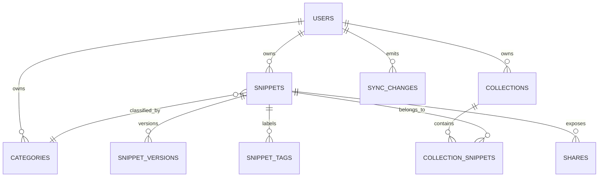

# Cloud Sync Architecture Decision

**Status:** Accepted for implementation  
**Date:** 2026-08-11  
**Decision owner:** Snippet Bubbles

## Decision

Snippet Bubbles will use the existing **MySQL/TiDB + Drizzle + tRPC + Manus OAuth** stack for its cloud data. The platform template already configures a MySQL-compatible `DATABASE_URL`, `mysql2`, and Drizzle MySQL primitives; converting the project to PostgreSQL before any domain data exists would create cost and migration risk without a product benefit. The earlier PostgreSQL description is treated as stale documentation, not an implementation contract.

The client remains **local-first**. AsyncStorage is the immediate interaction store, while an authenticated server becomes the durable source of truth for signed-in users. Anonymous use remains local only until the user chooses to sign in and sync.

## Product promises after this decision

| Capability | Current status | Product language allowed now |
|---|---|---|
| Local snippet library | Shipped | “Local-first snippet library.” |
| Cross-device sync | In implementation | Do **not** call it shipped until push/pull, conflicts, and recovery pass validation. |
| Cloud backup | In implementation | Do **not** claim automatic backup yet. |
| Share links | In implementation | Do **not** claim durable or revocable public links yet. |
| Real-time collaboration | Roadmap | Do **not** imply it is available. |

## Domain model

The server will maintain normalized ownership-scoped tables. Client IDs remain UUID-like strings, allowing offline creation without waiting for a server-generated identifier.

| Table | Responsibility | Key constraints and indexes |
|---|---|---|
| `snippets` | Current canonical snippet state | Unique `(userId, clientId)`; indexes on `(userId, updatedAt)` and `(userId, deletedAt)`. |
| `snippetVersions` | Immutable history snapshots | Foreign key to snippet; index `(snippetId, createdAt)`. |
| `categories` | Hierarchical personal categories | Unique `(userId, clientId)`; parent must belong to same user at application layer. |
| `collections` | Personal collections | Unique `(userId, clientId)`. |
| `collectionSnippets` | Many-to-many collection membership | Composite primary key `(collectionId, snippetId)`. |
| `snippetTags` | Normalized tags | Composite primary key `(snippetId, tag)`. |
| `shares` | Durable, revocable public-share metadata | Unique random `token`; index `(snippetId, revokedAt, expiresAt)`. |
| `syncChanges` | Ordered user change log | Index `(userId, sequence)`; append-only payload metadata, not raw secrets. |

## Sync protocol

The first release uses a **cursor-based, operation-log protocol** rather than live sockets.

1. The client writes a local change immediately and appends a pending operation with a generated `operationId`.
2. On a signed-in, reachable session, the client pushes a bounded batch of operations.
3. The server verifies ownership, applies each operation idempotently, creates a sync-change entry, and returns acknowledged operation IDs plus the highest cursor.
4. The client pulls changes after its last cursor and merges records locally.
5. A sync-conflict record is returned when a server version is newer than the client base timestamp/version. The first implementation uses explicit **server-wins with local recovery copy** until a user-facing merge workflow is built.

## Security invariants

| Invariant | Enforcement |
|---|---|
| A user cannot read or mutate another user’s record. | Every data procedure is `protectedProcedure`; every query predicates `userId = ctx.user.id`. |
| Client-supplied IDs are not authorization. | Lookups combine record ID/client ID with owner ID. |
| Replayed writes are harmless. | Sync operations have unique `(userId, operationId)` idempotency keys. |
| Deleted data does not silently resurrect. | Tombstones include deletion time/version and flow through the change log. |
| Public shares cannot grant write access. | Share tokens expose explicitly scoped read-only snapshots only. |
| Sensitive code is not copied into operational logs. | Sync audit metadata stores operation type, IDs, timestamps, and sizes—not raw snippet text. |

## Rollout sequence

1. Add schema and ownership-scoped server CRUD with tests.
2. Add one-way signed-in backup from local data, including explicit migration consent.
3. Add cursor pull/push and idempotent operation handling.
4. Add visible sync status, retry behavior, and conflict recovery.
5. Add durable share records and revocation.
6. Only then market cloud sync or sharing as shipped.

## Non-goals for the first sync release

Real-time collaborative editing, CRDTs, public community templates, and automated scheduled backups are intentionally deferred. They add complexity but do not make a broken sync foundation less broken. First we build the floor; later we invite a marching band.
